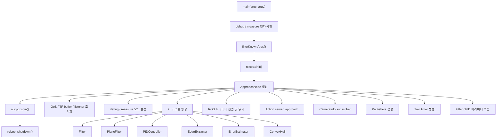
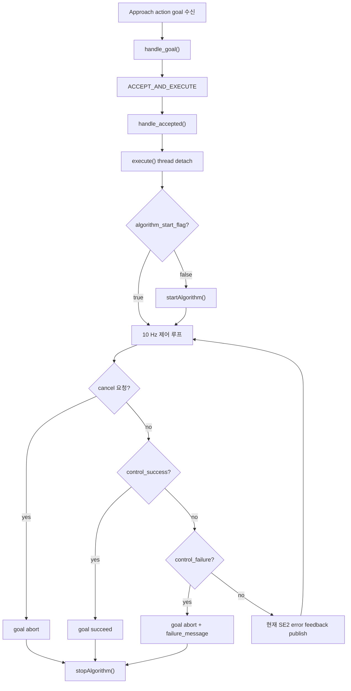
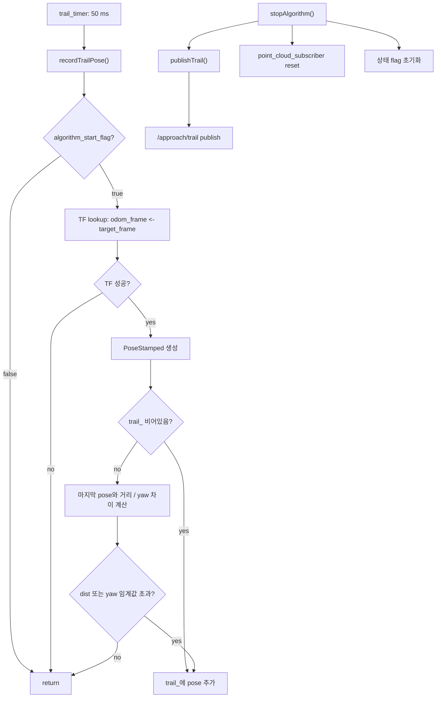
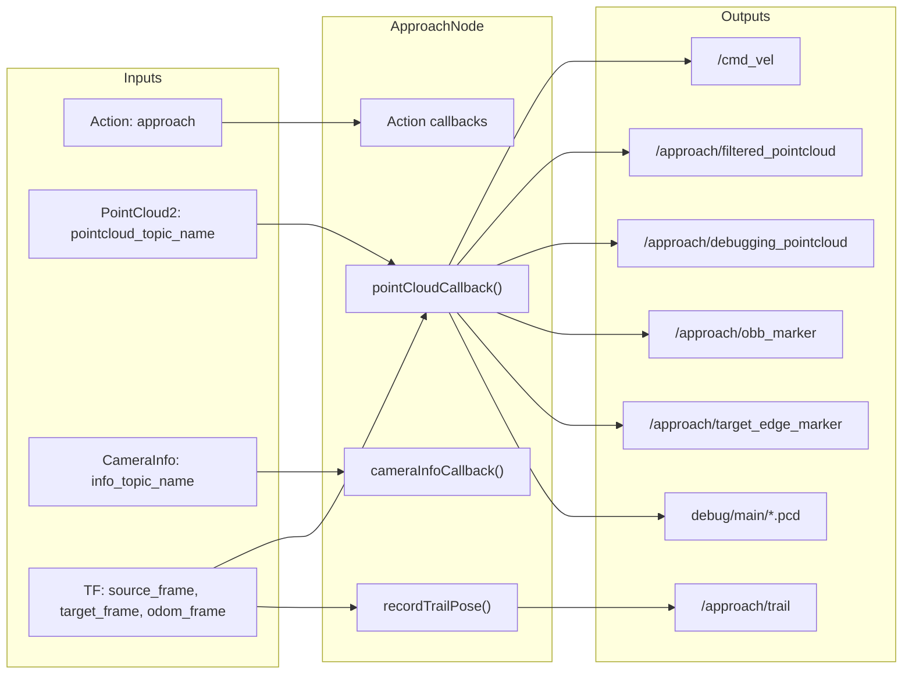

# main.cpp Diagram

## 1. 전체 실행 구조

```mermaid
flowchart TD
    A["main(argc, argv)"] --> B["debug / measure 인자 확인"]
    B --> C["filterKnownArgs()"]
    C --> D["rclcpp::init()"]
    D --> E["ApproachNode 생성"]
    E --> F["rclcpp::spin()"]
    F --> G["rclcpp::shutdown()"]

    E --> E1["QoS / TF buffer / listener 초기화"]
    E --> E2["debug / measure 모드 설정"]
    E --> E3["처리 모듈 생성"]
    E3 --> M1["Filter"]
    E3 --> M2["PlaneFilter"]
    E3 --> M3["PIDController"]
    E3 --> M4["EdgeExtractor"]
    E3 --> M5["ErrorEstimator"]
    E3 --> M6["ConvexHull"]

    E --> E4["ROS 파라미터 선언 및 읽기"]
    E --> E5["Action server: approach"]
    E --> E6["CameraInfo subscriber"]
    E --> E7["Publishers 생성"]
    E --> E8["Trail timer 생성"]
    E --> E9["Filter / PID 파라미터 적용"]
```

## 2. Action 생명주기

```mermaid
flowchart TD
    A["Approach action goal 수신"] --> B["handle_goal()"]
    B --> C["ACCEPT_AND_EXECUTE"]
    C --> D["handle_accepted()"]
    D --> E["execute() thread detach"]

    E --> F{"algorithm_start_flag?"}
    F -->|false| G["startAlgorithm()"]
    F -->|true| H["10 Hz 제어 루프"]
    G --> H

    H --> I{"cancel 요청?"}
    I -->|yes| J["goal abort"]
    J --> K["stopAlgorithm()"]

    I -->|no| L{"control_success?"}
    L -->|yes| M["goal succeed"]
    M --> K

    L -->|no| N{"control_failure?"}
    N -->|yes| O["goal abort + failure_message"]
    O --> K

    N -->|no| P["현재 SE2 error feedback publish"]
    P --> H
```

## 3. 메인 파이프라인 블록 다이어그램

```mermaid
flowchart LR
    A["Camera<br/>PointCloud2"] --> B["Preprocessing"]
    B --> C["OBB<br/>Estimation"]
    C --> D["Edge<br/>Estimation"]
    D --> E["Error<br/>Setting"]
    E --> H["SE(2) Error<br/>x, y, theta"]
    H --> F["PID<br/>Control"]
    F --> G["/cmd_vel"]

    subgraph B_DETAIL["Preprocessing 내부"]
        direction TB
        B1["Voxel Downsampling"]
        B2["Outlier Removal"]
        B3["TF Transform"]
        B4["Ground Removal"]
        B5["Spatial ROI"]
        B6["Clustering"]
        B7["Projection + Front Slicing"]
        B1 --> B2 --> B3 --> B4 --> B5 --> B6 --> B7
    end

    B -.-> B1
    B7 -.-> C

    subgraph E_DETAIL["Error Setting 내부"]
        direction TB
        E1["SE(2) Error Estimation"]
        E2["Spike Filtering"]
        E3["Tolerance Check"]
        E1 --> E2 --> E3
    end

    E -.-> E1
```

## 4. Trail 기록 흐름

```mermaid
flowchart TD
    A["trail_timer: 50 ms"] --> B["recordTrailPose()"]
    B --> C{"algorithm_start_flag?"}
    C -->|false| R["return"]
    C -->|true| D["TF lookup: odom_frame <- target_frame"]
    D --> E{"TF 성공?"}
    E -->|no| R
    E -->|yes| F["PoseStamped 생성"]
    F --> G{"trail_ 비어있음?"}
    G -->|yes| H["trail_에 pose 추가"]
    G -->|no| I["마지막 pose와 거리 / yaw 차이 계산"]
    I --> J{"dist 또는 yaw 임계값 초과?"}
    J -->|yes| H
    J -->|no| R

    K["stopAlgorithm()"] --> L["publishTrail()"]
    L --> M["/approach/trail publish"]
    K --> N["point_cloud_subscriber reset"]
    K --> O["상태 flag 초기화"]
```

## 5. ROS 입출력 요약

```mermaid
flowchart LR
    subgraph Inputs["Inputs"]
        A1["Action: approach"]
        A2["PointCloud2: pointcloud_topic_name"]
        A3["CameraInfo: info_topic_name"]
        A4["TF: source_frame, target_frame, odom_frame"]
    end

    subgraph Node["ApproachNode"]
        B1["Action callbacks"]
        B2["pointCloudCallback()"]
        B3["cameraInfoCallback()"]
        B4["recordTrailPose()"]
    end

    subgraph Outputs["Outputs"]
        C1["/cmd_vel"]
        C2["/approach/filtered_pointcloud"]
        C3["/approach/debugging_pointcloud"]
        C4["/approach/obb_marker"]
        C5["/approach/target_edge_marker"]
        C6["/approach/trail"]
        C7["debug/main/*.pcd"]
    end

    A1 --> B1
    A2 --> B2
    A3 --> B3
    A4 --> B2
    A4 --> B4

    B2 --> C1
    B2 --> C2
    B2 --> C3
    B2 --> C4
    B2 --> C5
    B2 --> C7
    B4 --> C6
```
